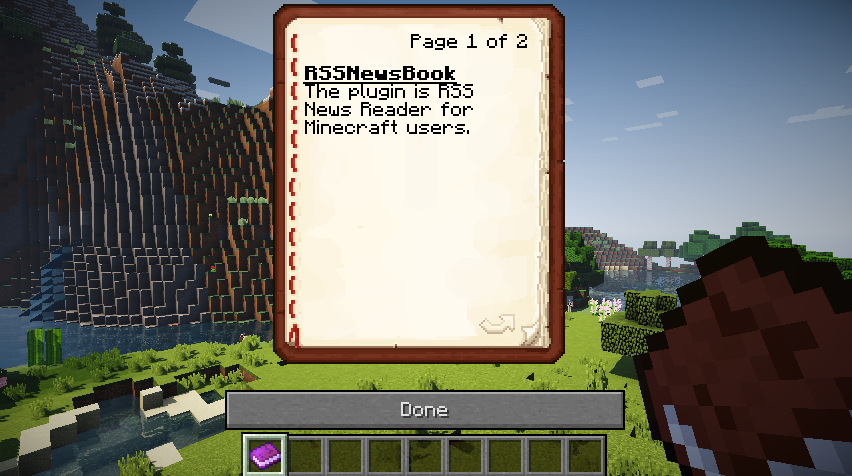

RSSNewsBook
=======================================




The plugin is Spigot plugin.

* Tested: v1.10, v1.9.2

Getting Started
---------------------------------------

1. Hold Written Book in your main hand.
2. Run `/rssnews add [myNewsId] [URL]`
  * e.g.) `/rssnews add nytimes http://rss.nytimes.com/services/xml/rss/nyt/HomePage.xml`
3. `/rssnews list`
4. `/rssnews convert nytimes`


Permissions
---------------------------------------

Follow the basic permission settings:

```yaml
groups:
  default:
    options:
      default: true
    permissions:
    - rssnewsbook.command.*
  Admin:
    permissions:
    - rssnewsbook.admin.*
```

All commands:

| Commands          | Permission                    |
|:------------------|:------------------------------|
| /rssnews list     | rssnewsbook.command.list      |
| /rssnews convert  | rssnewsbook.command.convert   |
| /rssnews update   | rssnewsbook.command.update    |
| /rssnews add      | rssnewsbook.admin.command.add |


Debug
---------------------------------------

* spigot-1.10.jar and spigot-1.9.2.jar put on `/path/to/project_root/libs/`
* run server:

```sh
cd /path/to/project_root/
./run-debug.sh 1.10
```

* Run debug on IntelliJ. Follow the article: [IntelliJ: Debug Your Plugin](https://www.spigotmc.org/wiki/intellij-debug-your-plugin/).


